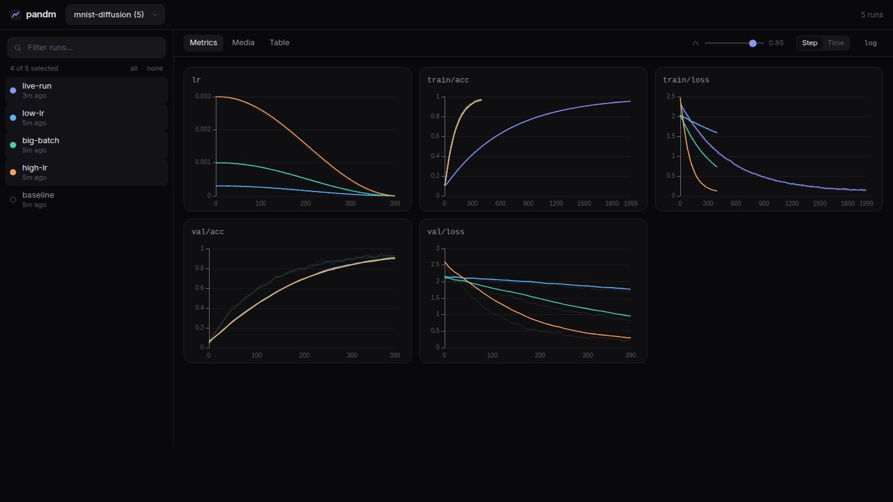

# pandm

pandm tracks ML experiments locally. The Python SDK writes metrics and images straight to a `.pandm/` directory next to your code — no account, no daemon, no cloud — and `pandm ui` serves a dashboard to compare runs. Unlike wandb there is nothing to sign up for, and unlike tensorboard the data is plain SQLite + PNG files you can query yourself. The same scripts report to a shared server over HTTP when you set one env var.



## Install

```sh
pip install pandm
```

## Quick start

```python
import pandm

run = pandm.init(project="mnist", config={"lr": 1e-3, "batch_size": 64})
for step in range(1000):
    loss, acc = train_step()
    run.log({"train/loss": loss, "train/acc": acc}, step=step)
    if step % 100 == 0:
        run.log_image("samples", sample_grid, step=step)  # PIL / numpy / torch / path
run.summary({"best/acc": 0.99, "best/epoch": 7})  # the chosen checkpoint's self-consistent row
run.finish()
```

```sh
pandm ui   # opens http://127.0.0.1:7878
```

The dashboard overlays selected runs per metric, with smoothing, log scale, step/time axes, an image browser with a step slider, and a config/summary comparison table. It polls while runs are alive, so curves grow during training.

## Usage

`step` is optional (an internal counter is used). Runs end as `finished` or `crashed`: uncaught exceptions are detected via `sys.excepthook` (and the context manager), and hard-killed processes (`kill -9`, OOM) are presumed crashed once their 15s heartbeat goes quiet for 60s — self-healing if the process was merely suspended.

```python
with pandm.init(project="mnist") as run:
    run.log({"loss": 0.5})
```

Inspect, export or delete runs from the terminal:

```sh
pandm ls                          # list runs
pandm show <run_id>               # config, summary, logged metrics
pandm export <run_id> > data.csv  # full series as CSV (or --json, -k <key>)
pandm delete <run_id>             # local + cloud copy when signed in
```

Data lives in `./.pandm` by default; override with `--dir` or `PANDM_DIR`.

### Resuming a run

Give a run a stable `id` and pass `resume=True` to continue it after a crash, a
preemption (spot/OOM), or a manual restart — the run flips back to `running` and
its step counter picks up past the last logged step instead of starting a second,
disconnected run. Its original config is kept.

```python
run = pandm.init(project="mnist", id="exp-42", resume=True)  # continue if it exists, else start fresh
# resume="must" errors if exp-42 is missing; a fresh id that already exists errors unless resume is set
```

`pandm show` reports `MIN`/`MAX` per metric next to the last value (and the read
API carries a `stats` field — `{min, max, last, count}` per key — so the
dashboard and `pandm-inspect` can pick the best run, not just the latest value).

### Hugging Face Accelerate

Pass a `PandmTracker` instance to `Accelerator` (Accelerate only resolves strings for its built-in trackers) — `accelerator.log` then reports to pandm, and `end_training` finishes the run:

```python
from accelerate import Accelerator
from pandm.integrations.accelerate import PandmTracker

accelerator = Accelerator(log_with=PandmTracker(project="mnist", name="baseline"))
accelerator.init_trackers("mnist", config={"lr": 1e-3})
accelerator.log({"loss": 0.42}, step=10)
accelerator.end_training()
```

For images, unwrap the raw run: `accelerator.get_tracker("pandm", unwrap=True).log_image("samples", img, step=step, caption=prompt)`.

### Cloud mode

Training scripts never change — sign in once per machine and `pandm.init()` dual-writes: local stays the source of truth, a background thread syncs to the server, and anything logged offline is backfilled on reconnect. Delivery is exact-once (re-pushes are deduped server-side).

```sh
pandm login        # hosted cloud (pandm.jannchie.com); pass a URL for self-hosted
python train.py    # local + cloud
pandm sync         # backfill runs whose process already exited
```

`pandm login` uses device-flow approval (like `gh auth login`): it prints a URL
to open in any browser and polls until you approve — so it works over ssh, where
it won't try to open a browser on the remote host. Until you're signed in, the
first `pandm.init()` offers to log in on an interactive terminal, or prints a
one-line hint on a non-interactive one (CI, `nohup`, ssh) — it never blocks a
run. `PANDM_SILENT=1` silences the hint for good, as does logging in or choosing
*keep local*.

Each user signs in with GitHub and sees only their own runs. Two interchangeable server implementations speak the same protocol — the full walkthrough (OAuth App, custom domain, backups, troubleshooting) is in **[docs/deploy.md](docs/deploy.md)**:

**Cloudflare Workers** (serverless: D1 for metrics, R2 for media — `workers/`):

```sh
cd workers && pnpm install
npx wrangler d1 create pandm             # paste the database_id into wrangler.jsonc
npx wrangler secret put GITHUB_CLIENT_ID     # OAuth App callback: https://<domain>/api/auth/callback
npx wrangler secret put GITHUB_CLIENT_SECRET
npx wrangler secret put PANDM_SECRET_KEY     # e.g. `openssl rand -hex 32`
npx wrangler d1 migrations apply pandm --remote
pnpm run deploy
```

> Note: D1 bills per row written (100k/day free). Logging ~10 metrics/sec around the clock lands in the paid tier — a few dollars a month.

**Self-hosted Python server** (same binary as `pandm ui`):

```sh
GITHUB_CLIENT_ID=… GITHUB_CLIENT_SECRET=… docker compose up -d   # multi-user mode
```

Without OAuth env vars the server falls back to single-tenant mode — `pandm server --api-key my-secret` plus `PANDM_REMOTE`/`PANDM_API_KEY` on the client (remote-only, no local copy, no accounts).

## API

| | |
|---|---|
| `pandm.init(project, name=None, config=None, *, id=None, resume=False, total_steps=None, directory=None, remote=None, api_key=None)` | start (or resume) a run |
| `run.log(metrics, step=None)` | log scalar metrics |
| `run.log_image(key, image, step=None, caption=None)` | log an image |
| `run.summary(values)` | record run-level scalars (the chosen checkpoint's metric row); merges across calls |
| `run.finish(status="finished")` | end the run (also via `atexit`) |
| `GET /api/docs` | REST API reference on any running server |

## Agent skills

LLM/agent harnesses can drive pandm through two [Agent Skills](skills/): one to
record runs, one to read them back as JSON. Install them with
[`npx skills`](https://github.com/vercel-labs/skills):

```sh
npx skills add Jannchie/pandm --skill pandm-track --skill pandm-inspect
```

`-g` installs at the user level, `-a claude-code` targets one agent. See
[skills/README.md](skills/README.md) for what each skill does.

## Development

```sh
uv sync && uv run pytest          # python sdk + server
cd web && pnpm install && pnpm dev   # dashboard dev server (proxies to :7878)
pnpm build                        # bundles the dashboard into src/pandm/static
cd workers && pnpm install && pnpm test   # cloudflare workers server (contract tests)
```

## License

MIT
